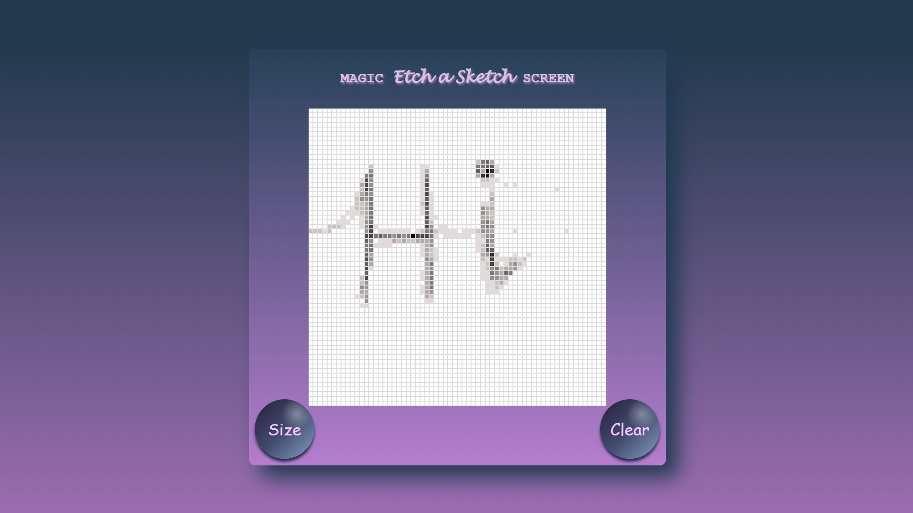

# 🎨 Etch-a-Sketch

A browser-based Etch-a-Sketch drawing application built with **HTML**, **CSS**, and **JavaScript** as part of **The Odin Project** Foundations curriculum.

Users can create a customizable drawing grid, sketch by hovering over cells, and clear the canvas to start again.

## ✨ Features

- 🎯 Dynamic grid generation (1–100 × 1–100)
- 🖌️ Draw by hovering over grid cells
- 🌸 Progressive opacity effect on each hover
- 🧹 Clear button to reset the drawing
- 📱 Responsive and clean interface
- ⚡ Built using vanilla JavaScript (no libraries)

## 📸 Preview

## 🛠️ Built With

- HTML5
- CSS3 (Flexbox)
- JavaScript (ES6)

## 📚 What I Learned

While building this project, I practiced:

- DOM manipulation
- Dynamic element creation
- Event listeners
- JavaScript functions
- Loops
- User input using `prompt()`
- Using `data-*` attributes
- Styling elements dynamically with JavaScript
- Managing application state

## 🎯 Future Improvements

- 🌈 Random color mode
- 🌑 Dark mode
- 🎨 Color picker
- 🖱️ Click-and-drag drawing
- 📱 Improved mobile responsiveness
- 💾 Save artwork as an image

## 🔗 Live Demo

[https://your-live-demo-link.com](https://7pixiee.github.io/Etch-a-Sketch/)